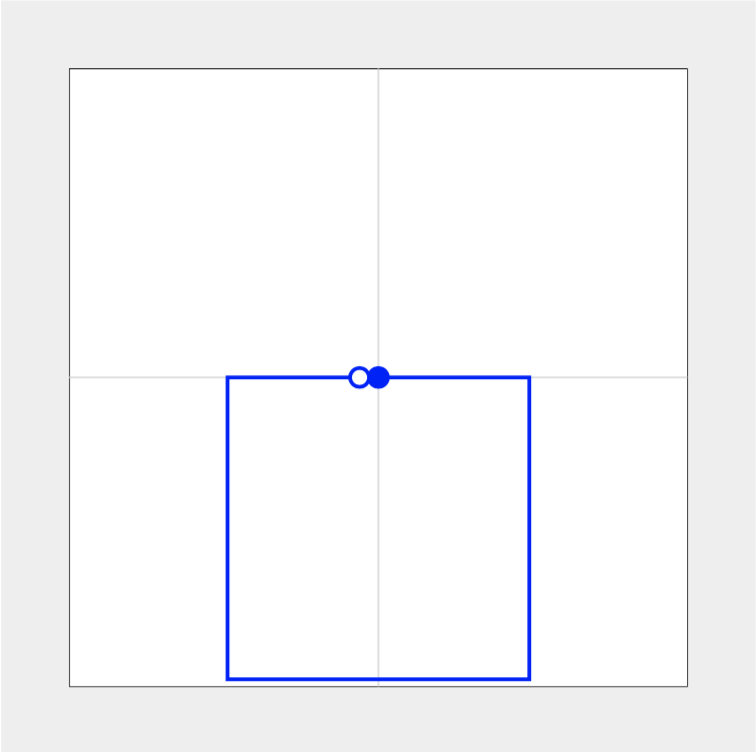
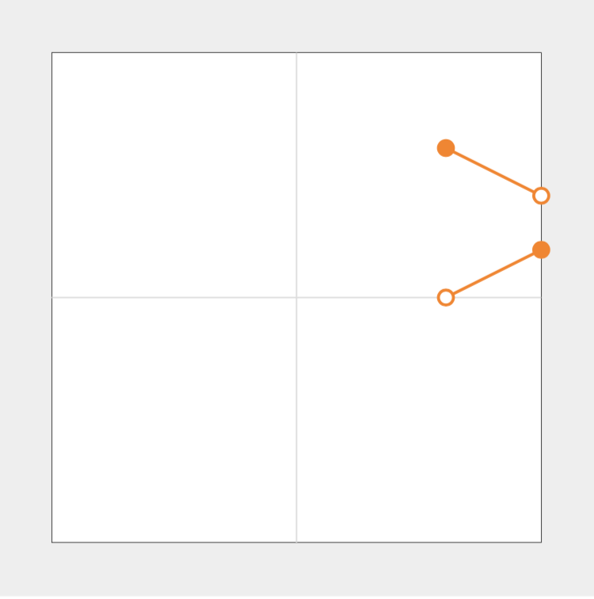

# Graphic Mini-language Parser

This is a command-line interface which uses monadic parsing to produce commands for a drawing-system from opcode strings.

## Integers

Integers in the opcode string are encoded according to the following scheme. Valid integers are between [-8192, +8191]. 

To encode a raw decimal:

  * Add 8192 to the decimal.
  * Convert decimal to 16-bit binary. Since valid integers are 14-bit, 2 most significant bits will be cleared:
  ```
  00HHHHHH HLLLLLLL
  ```

  * Pack bytes such that the most significant bit of each is cleared:
  ```
  0HHHHHHH 0LLLLLLL
  ```
  * Finally, convert resulting binary numeral into hexadecimal.

### Sample Values

Unencoded (decimal) | Encoded (hex)
--- | ---
`0` | `4000`
`8191` | `7F7F`
`2048` | `5000`
`-4096` | `2000`

## Commands

### Clear

Command | Opcode | Parameters | Output
--- | --- | --- | --- 
`CLR` | `F0` | none | `CLR; \n`

This command resets pen position and color.

### Pen Up/Pen Down

Command | Opcode | Parameters | Output
--- | --- | --- | --- 
`PEN` | `80` | 0 = pen up, any other integer value = pen down | `PEN UP; \n` or `PEN DOWN; \n`

When pen is up, no mark is made.

### Color

Command | Opcode | Parameters | Output
--- | --- | --- | --- 
`CO` | `A0` | R, G, B, and Alpha. (0...255) | `CO {R} {G} {B} {A}`

### Move

Command | Opcode | Parameters | Output
--- | --- | --- | --- 
`MV` | `C0` | `x0 y0 [x1 y1 ... xn yn]` | If pen is up, move to final position. Otherwise: `MV (x0, y0) [... (xn, yn)];\n`

While the encoded commands will give coordinates relative to current pen position, output should display absolute coordinates.

If command takes pen outside of (-8192, -8192) ... (8191, 8191) then pen should move until it reaches the boundary, lift, and then lower once it re-enters the canvas.

## Examples

### Blue Square

Input:

```
F0A040004000417F417FC04000400090400047684F5057384000804001C05F204000400001400140400040007E405B2C4000804000
```



Output:

```
CLR;
CO 0 0 255 255;
MV (0, 0);
PEN DOWN;
MV (4000, 0) (4000, -8000) (-4000, -8000) (-4000, 0) (-500, 0);
PEN UP;
```

### Clipping on Canvas Border

```
F0A0417F41004000417FC067086708804001C067082C3C18782C3C804000
```



Output:

```
CLR;
CO 255 128 0 255;
MV (5000, 5000);
PEN DOWN;
MV (8191, 3405);
PEN UP;
MV (8191, 1596);
PEN DOWN;
MV (5000, 0);
PEN UP;
```


